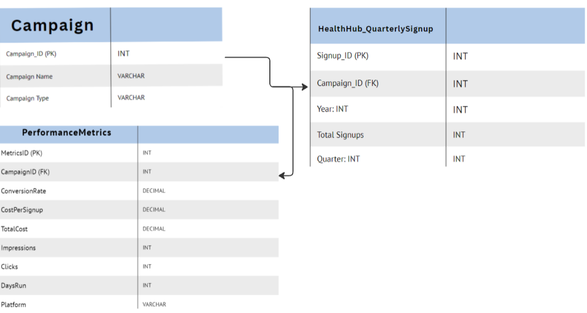
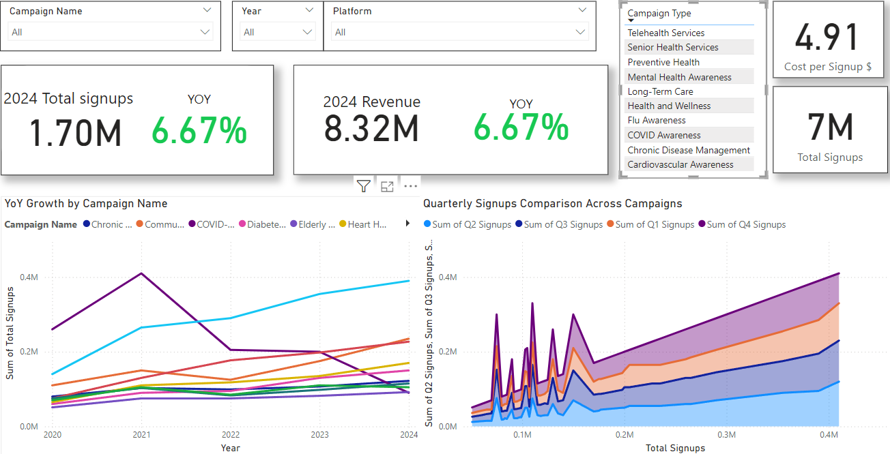
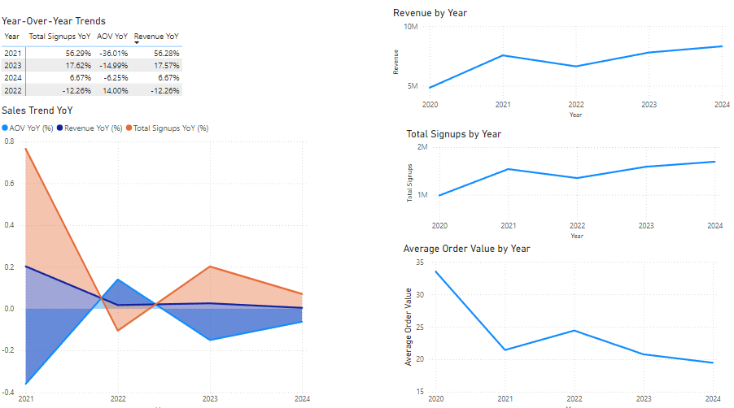

# HealthHub Campaign Analysis

## Project Background

HealthHub is a healthcare company focused on delivering high-quality health services and promoting awareness through targeted campaigns via its website and mobile app.

The company has accumulated significant amounts of data on its sales, campaigns, operational efficiency, plan offerings, and loyalty programs, which have been underutilized. This project aims to thoroughly analyze and synthesize this data to uncover critical insights that can improve HealthHub's commercial success.

### Key Insights and Recommendations:

- **Signup Trends Analysis**: Evaluation of historical signup patterns, both **globally** and **by campaign type**, focusing on total signups, cost, and Average Order Value (AOV).
  
- **Click Conversion Rate into Signups**: An analysis of HealthHub's various campaign types to understand their impact on signups and the value they bring to the organization.

- **Seasonal and Time-Based Trends**: An examination of how seasonal trends affect signup patterns and the effectiveness of timing in campaign launches.

- **Cost Analysis**: A detailed review of the costs associated with each campaign type, highlighting areas for optimization and efficiency in marketing spend.

---

## Executive Summary

### Overview of Findings:

After peaking in late 2021, HealthHub's sales significantly declined by 2022. Key performance indicators show two consecutive years of increases in order volume and revenue by **6.67%**, with the **average signup cost** now at **$3.30**. While these increases can be broadly attributed to a return to pre-pandemic normalcy, additional contributing factors are explored in the following sections, which also highlight key opportunities for improvement.

Below is an overview page from the Power BI dashboard, with more examples included throughout the report. The entire interactive dashboard can be downloaded [here](#).

---

### Sales Trends:

- The company's sales peaked in 2021 with **1,541,000 orders**, totaling **$7,560,146** in yearly revenue. This peak aligns with the surge in healthcare demand during the COVID-19 pandemic, as consumer behavior shifted with more people seeking healthcare services and products online.
- Starting in the first quarter of 2023, the average order value (AOV) dropped year-over-year for 24 consecutive months, marking a **21% decrease** compared to the previous year’s AOV.
- Despite this decline in AOV, both signups and revenue have increased as more customers are joining campaigns. Though customers are opting for lower-priced campaigns more frequently, the increased transaction volume pushed the company’s revenue to an all-time high of **$8,320,576**.
- A significant drop in AOV was also observed in early 2020, largely due to the lower-cost **COVID-19 Vaccination Drive** campaign, which contributed to the overall decrease.
